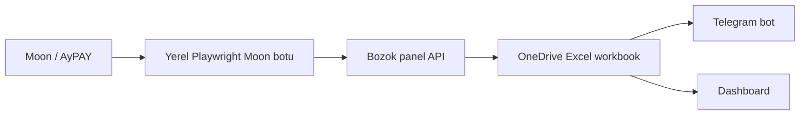

# Excel / OneDrive Merkez Kurulumu

Bu katman Excel'i ortak veri merkezi yapar. Varsayılan kapalıdır; env değişkenleri girilmeden mevcut Render/Postgres sistemi aynen çalışır.

## Azure'suz Yerel OneDrive Klasör Merkezi

Azure para/kart isterse bu yolu kullan. OneDrive masaüstü klasörü dosyaları buluta senkronlar; panel, bot ve Excel aynı klasörü merkez kabul eder.

Bu cihazda merkez klasör:

```text
C:\Users\user\OneDrive\BozokMerkez
```

Env:

```env
ONEDRIVE_CENTER_ENABLED=1
ONEDRIVE_CENTER_PRIMARY=0
ONEDRIVE_CENTER_DIR=C:\Users\user\OneDrive\BozokMerkez
ONEDRIVE_SYNC_MIN_MS=500
```

İlk kurulumda `ONEDRIVE_CENTER_PRIMARY=0` kalsın. Panel mevcut ortak kayıttan çalışır ama her değişikliği OneDrive klasörüne de basar. Dosyaların oluştuğunu gördükten sonra istersen `ONEDRIVE_CENTER_PRIMARY=1` yapılır.

Render'sız ana merkez modu için:

```powershell
.\bozok-canli-baslat.cmd
```

Bu komut `tools/start-excel-primary.ps1` üzerinden yerel sistemi açar:

- `ONEDRIVE_CENTER_PRIMARY=1`: Panel, Telegram bot ve Moon cache önce OneDrive merkez dosyalarından okur.
- `DATABASE_DISABLED=1`: Postgres/Render veritabanı ana kayıt olmaktan çıkar.
- `TELEGRAM_USE_POLLING=1`: Telegram bot webhook yerine bu bilgisayardan çalışır.
- `MOON_AUTOMATION_ENABLED=1`: Moon verisi yerel Playwright botu ile alınır.

Bu modda açık kalması gereken şey Render değil, bu yerel komut penceresidir. Telegram token aynı anda hem Render webhook'ta hem local polling'de çalıştırılmamalı; Render kapatılacaksa önce Render env tarafında `BOZOK_DISABLE_TELEGRAM=1` ve `MOON_AUTOMATION_ENABLED=0` yapılır veya servis durdurulur.

O klasöre otomatik yazılan dosyalar:

- `bozok-state.json`: Panelin tam ortak kaydı.
- `moon-cache.json`: En son Moon canlı payload.
- `bozok-live.csv`: Excel'in direkt içeri alabileceği anlık panel bakiyesi.
- `kasalar.csv`: Atlas/Ecem/Aslan/Ares banka hesapları.
- `formul.csv`: Kasa yapma aracı satırları.
- `blokeler.csv`: Güncel bloke satırları.

Excel merkez dosyasını üretmek veya yeniden bağlamak için:

```powershell
npm run onedrive:workbook
```

Bu komut `C:\Users\user\OneDrive\BozokMerkez\BozokMerkez.xlsx` dosyasını oluşturur. Dosya `DP_LIVE`, `KASALAR`, `FORMUL`, `BLOKELER` CSV'lerini QueryTable olarak bağlar. Excel içinde `Veri > Tümünü Yenile` ile son CSV verisi alınır; dosya açılışında da yenileme ayarı aktiftir.

Yenile tuşuna basmadan canlı akış için:

```powershell
npm run bozok:live
```

Bu komut iki arka plan işi başlatır:

- `http://localhost:8787` yerel köprüsü: Playwright Moon botunun 1 saniyelik canlı verisini OneDrive klasörüne yazar.
- Excel watcher: `BozokMerkez.xlsx` açıksa CSV değiştiğinde workbook'u otomatik yeniler.

Moon otomasyon giriş bilgileri `.env` içinde yoksa canlı veri üretilemez. Bu durumda dosyalar son başarılı veride kalır.

Kontrol endpointleri:

- `/api/onedrive-status`
- `/api/onedrive-sync`

## Akış



İlk etapta güvenli mod:

- `EXCEL_CENTER_ENABLED=1`: Paneldeki ortak kayıt ve canlı Moon verisi Excel'e yazılır.
- `EXCEL_CENTER_PRIMARY=0`: Panel ve bot okumaya hâlâ mevcut ortak kayıttan devam eder.

Her şey doğru yazıyorsa ana merkez modu:

- `EXCEL_CENTER_PRIMARY=1`: Panel ve bot önce Excel'den okumaya çalışır; Excel okunamazsa mevcut ortak kayda düşer.

## Excel Dosyası

OneDrive içinde bir `.xlsx` dosyası oluştur ve paylaşım linkini al. Kod aşağıdaki sayfaları otomatik oluşturur veya günceller:

- `DP_LIVE`: Anlık panel bakiyesi.
- `KASALAR`: Atlas/Ecem/Aslan/Ares hesapları.
- `FORMUL`: Kasa yapma aracı satırları.
- `BLOKELER`: Güncel bloke hesap tutarları.
- `SYSTEM`: Tema, stil, kapanış ve yardımcı kayıtlar.

## Microsoft Giriş Tokeni

1. Microsoft Entra/App Registration içinde bir uygulama oluştur.
2. Redirect/platform tarafında public client/device code kullanımına izin ver.
3. API izinleri: `offline_access`, `Files.ReadWrite`, `User.Read`.
4. `.env` içine `MS_CLIENT_ID` yaz.
5. Lokal terminalde çalıştır:

```bash
npm run ms:login
```

Çıkan `MS_REFRESH_TOKEN` gizlidir. Bunu GitHub'a koyma; yalnızca `.env` veya Render Environment içine yaz.

## Env Örneği

```env
EXCEL_CENTER_ENABLED=1
EXCEL_CENTER_PRIMARY=0
MS_TENANT_ID=consumers
MS_CLIENT_ID=...
MS_REFRESH_TOKEN=...
MS_GRAPH_SCOPES=offline_access Files.ReadWrite User.Read
EXCEL_WORKBOOK_SHARE_URL=https://1drv.ms/x/...
EXCEL_SYNC_MIN_MS=5000
```

`EXCEL_SYNC_MIN_MS` değerini çok düşürme. Microsoft Graph fazla sık yazımda throttle uygular. Canlı Moon verisi yine panelde hızlı akar; Excel merkezi kalıcı kayıt tarafıdır.

## Kontrol Endpointleri

- `/api/excel-status`: Excel merkez açık mı, son sync ne zaman, son hata ne.
- `/api/excel-sync`: Mevcut dashboard ve Moon cache'i Excel'e zorla yazar.
- `/api/health`: Excel durumunu da döndürür.

## Render'dan Kurtulma Planı

Excel merkez stabil olduktan sonra iki seçenek var:

1. Küçük bir lokal/Windows servis: Tampermonkey yerine açık oturumlu makinede çalışır, Excel'e yazar, Telegram botu da oradan çalışır.
2. OneDrive Excel + Microsoft Graph bot: Bot Excel'den okur, panel statik kalır; Render yalnızca geçici köprü olarak kapanabilir.

Tamamen Render'sız çalışmak için Telegram botunun çalışacağı bir makine veya hosting yine gerekir. Excel veriyi tutar; komutları karşılayacak bir süreç gene canlı olmalı.
